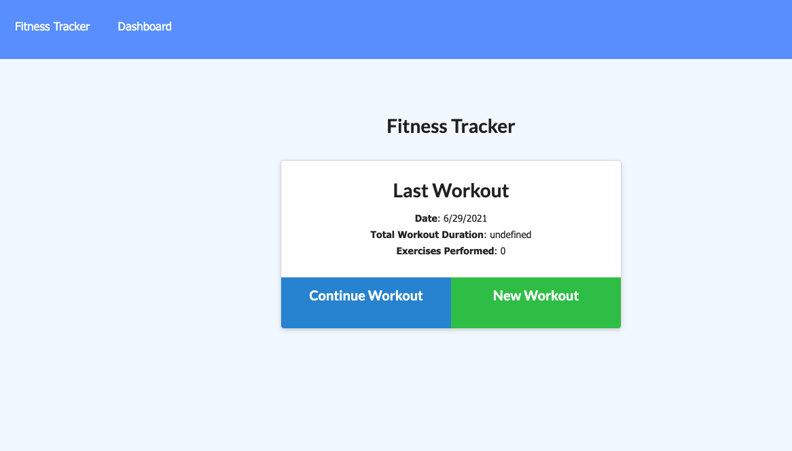

# mongo_fitness_tracker

## Description
The purpose if this assignment is to create an application that allows a user to view, create, and track daily workouts. The user should be able to log multiple exercises in a workout on a given day and should be able to track the name, type, weight, sets, reps, duration of exercise and the distance traveled, if relevant. 

link to github repo:
https://github.com/jcorcorangithub/mongo_fitness_tracker

link to application:
---

## Technologies
JavaScript
HTMl
CSS
Node.js
Express.js
MongoDb

## Contributors
I will be the sole contributor of this project 

## Contact
Name: James Corcoran 
email: jpcsoccer1234@gmail.com

